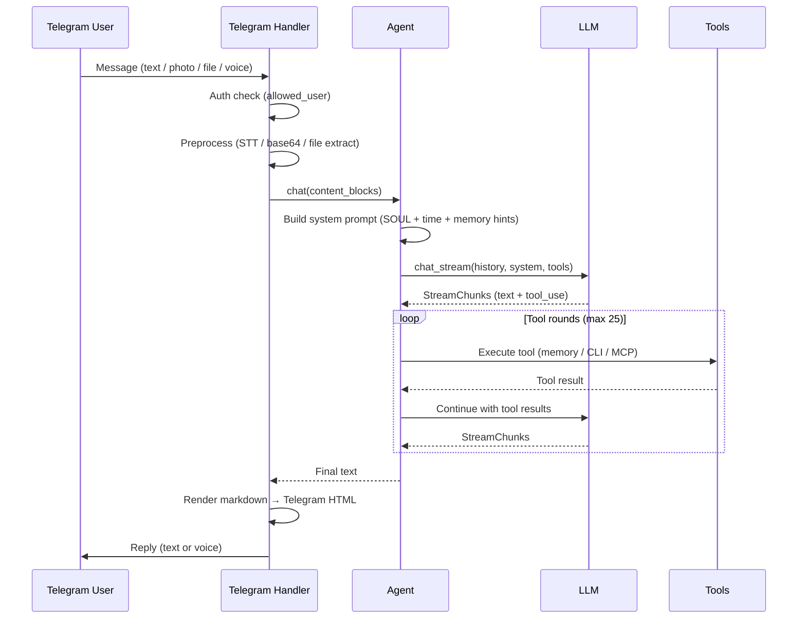

# Kernel Architecture

Technical documentation for contributors and advanced users.

<p align="center">
  <a href="ARCHITECTURE_CN.md">简体中文</a> | English
</p>

## Module Structure

```
kernel/
├── __init__.py
├── __main__.py                 # Entry point (asyncio.run → run_bot)
├── bot.py                      # Telegram Application setup, handler registration
├── bot_logging.py              # Logging configuration
├── bot_cleanup.py              # Periodic temp file cleanup
├── config.py                   # TOML config loader (with env var support)
├── config_load.py              # Config file resolution
├── config_types.py             # Dataclasses: Config, TelegramConfig, ProviderConfig, etc.
├── render.py                   # Markdown → Telegram HTML renderer (mistune-based)
├── agent.py                    # Agent (composed via mixins)
├── agent_chat.py               # Chat loop: streaming, tool dispatch, history
├── agent_tools.py              # Built-in tool registration, CLI delegation, MCP init
├── agent_sessions.py           # Session create/restore/switch
├── agent_history.py            # History truncation and slimming
├── agent_titles.py             # Auto-generate conversation titles
├── agent_content.py            # Content block serialization
├── tg_common.py                # BotState, user check, send helpers
├── tg_message.py               # Main message handler (text/photo/file/voice)
├── tg_message_utils.py         # File type detection, TTS text extraction
├── tg_commands_sessions.py     # /new, /history, /resume, /retitle, /del_history
├── tg_commands_memory.py       # /remember, /memory, /forget
├── tg_commands_settings.py     # /provider, /model, /cancel, /status
├── models/
│   ├── base.py                 # ABC: LLM, Message, ToolDef, StreamChunk, ContentBlock
│   ├── claude.py               # Anthropic Messages API implementation
│   └── openai_compat.py        # OpenAI-compatible API implementation
├── memory/
│   ├── store.py                # SQLite store (sessions, messages, settings, memories)
│   ├── memories.py             # FTS5 full-text search (jieba tokenizer), LIKE fallback
│   └── slim.py                 # Content slimming for DB storage
├── cli/
│   ├── base.py                 # CLIAgent ABC, subprocess lifecycle, timeout, output truncation
│   ├── claude_code.py          # Claude Code CLI adapter
│   └── codex.py                # Codex CLI adapter
├── mcp/
│   └── client.py               # MCP client: stdio/HTTP transport, tool registration, reconnect
├── tools/
│   └── registry.py             # Decorator-based tool registry, auto schema from type hints
└── voice/
    ├── stt.py                  # Speech-to-text (OpenAI Whisper API)
    └── tts.py                  # Text-to-speech (Edge TTS → ffmpeg → Opus)
```

---

## Execution Flow



---

## Agent Composition

The `Agent` class is assembled from five mixins:

| Mixin | Responsibility |
|-------|---------------|
| `AgentToolsMixin` | Built-in tools, CLI delegation, MCP tool registration |
| `AgentSessionsMixin` | Session lifecycle (create, restore, switch) |
| `AgentHistoryMixin` | Context window management, history truncation/slimming |
| `AgentChatMixin` | Streaming chat loop, tool dispatch (up to 25 rounds) |
| `AgentTitlesMixin` | Auto-generate session titles via a lightweight LLM |

```python
class Agent(AgentToolsMixin, AgentSessionsMixin, AgentHistoryMixin, AgentChatMixin, AgentTitlesMixin):
    ...
```

---

## LLM Abstraction

**Location**: `models/base.py`

All providers implement the `LLM` abstract class:

| Method | Purpose |
|--------|---------|
| `chat()` | Single-shot request → `LLMResponse` |
| `chat_stream()` | Streaming request → `AsyncIterator[StreamChunk]` |
| `close()` | Cleanup |

Content is modeled as typed blocks: `TextContent`, `ImageContent`, `ToolUseContent`, `ToolResultContent`.

### Providers

| Provider | Module | API |
|----------|--------|-----|
| Anthropic Claude | `models/claude.py` | Anthropic Messages API (native) |
| OpenAI-compatible | `models/openai_compat.py` | OpenAI Chat Completions (works with OpenAI, DeepSeek, etc.) |

Provider selection is runtime-switchable via `/provider` command.

---

## Memory System

**Location**: `memory/store.py`, `memory/memories.py`

### Storage

SQLite database (`data/kernel.db`) with WAL mode. Schema version tracked via `PRAGMA user_version`.

### Tables

| Table | Purpose |
|-------|---------|
| `sessions` | Conversation metadata (title, timestamps, archived flag) |
| `messages` | Chat messages (JSON content, linked to session) |
| `settings` | Key-value store (current provider, model, etc.) |
| `memories` | Long-term memory entries |
| `memories_fts` | FTS5 virtual table for full-text search (if available) |

### Full-Text Search

**Location**: `memory/memories.py`

- Tokenizer: **jieba** (Chinese + English segmentation)
- FTS5 index built on startup; falls back to `LIKE` if FTS5 is unavailable
- Search strategy: exact match → OR query → LIKE fallback
- Terms are filtered (min length 2, stop words removed, max 8 terms)

### AI-Driven Memory

The system prompt instructs the LLM to autonomously call `memory_search` when a question may depend on user preferences or history. The LLM decides when to store and recall — no hardcoded triggers.

---

## Tool System

**Location**: `tools/registry.py`

### Registry

`ToolRegistry` uses a decorator pattern. Parameter schemas are auto-generated from Python type hints:

```python
@registry.tool("memory_add", description="Store to long-term memory")
async def memory_add(text: str) -> dict:
    ...
```

Type mapping: `str→string`, `int→integer`, `float→number`, `bool→boolean`, `list[T]→array`, `Literal[...]→enum`.

### Built-in Tools

| Tool | Purpose |
|------|---------|
| `delegate_to_cli` | Delegate tasks to CLI agents (Claude Code / Codex) |
| `memory_add` | Store a memory |
| `memory_search` | Search memories |
| `memory_list` | List all memories |
| `memory_delete` | Delete a memory by ID |

### MCP Tools

MCP tools are dynamically registered at startup. Tool names are sanitized to `mcp_{server}__{tool}` format (max 64 chars, SHA1 suffix if truncated). Supports both stdio and HTTP (Streamable HTTP) transports. Auto-reconnect on failure (1 retry).

---

## CLI Delegation

**Location**: `cli/base.py`, `cli/claude_code.py`, `cli/codex.py`

### Process Lifecycle

1. Resolve command via `shutil.which`
2. Spawn subprocess (`asyncio.create_subprocess_exec` or `_shell` on Windows)
3. Wait with timeout (default 600s)
4. Capture stdout/stderr, truncate output (max 50K chars)
5. Save raw output to `data/cli_outputs/`

### Work Directory

- If `cwd` is provided: use it directly
- Otherwise: create a unique subdirectory under `tasks/` (`s{session}_{cli}_{timestamp}_{uid}`)

### Cancellation

`/cancel` command → `Agent.cancel()` → `proc.kill()` on the active CLI process.

---

## Voice Pipeline

### Speech-to-Text

**Location**: `voice/stt.py`

OpenAI Whisper API (or compatible). Downloads voice message as `.ogg`, transcribes, deletes temp file.

### Text-to-Speech

**Location**: `voice/tts.py`

1. Edge TTS generates MP3 (free, no API key)
2. ffmpeg converts MP3 → Opus/OGG (48kbps)
3. Sent as Telegram voice message

ffmpeg is bundled via `static-ffmpeg` (no system install needed).

---

## Telegram Message Rendering

**Location**: `render.py`

Custom **mistune** renderer (`TelegramHTMLRenderer`) converts Markdown to Telegram-compatible HTML:

| Markdown | Telegram HTML |
|----------|--------------|
| `**bold**` | `<b>bold</b>` |
| `*italic*` | `<i>italic</i>` |
| `` `code` `` | `<code>code</code>` |
| Code blocks | `<pre><code>...</code></pre>` |
| `~~strike~~` | `<s>strike</s>` |
| Lists | `• item` |
| Blockquotes | `▍ quoted` |

Messages exceeding 4096 chars are split at paragraph/line boundaries with proper HTML tag repair.

---

## Configuration

**Location**: `config.py`, `config_types.py`, `config_load.py`

TOML-based configuration. API keys support environment variable override (`env: KERNEL_*`).

### Config Sections

| Section | Required | Purpose |
|---------|----------|---------|
| `[telegram]` | Yes | Bot token, allowed user ID |
| `[general]` | Yes | Timezone, default provider, context rounds, memory settings |
| `[providers.*]` | Yes (≥1) | LLM provider configs (type, API key, models) |
| `[titles]` | No | Lightweight LLM for auto-generating session titles |
| `[stt]` | No | Speech-to-text (Whisper API endpoint) |
| `[tts]` | No | Text-to-speech (Edge TTS voice name) |
| `[cli.*]` | No | CLI agent commands and args |
| `[[mcp.servers]]` | No | MCP server connections |

---

## Data Directory

All runtime data lives under `data/` (configurable via `general.data_dir`):

```
data/
├── kernel.db           # SQLite database (sessions, messages, memories, settings)
├── cli_outputs/        # Raw CLI agent output files
├── downloads/          # Temporary file downloads (auto-cleaned after 7 days)
└── voice_replies/      # Temporary TTS output (auto-cleaned after 7 days)
```

Periodic cleanup runs every 6 hours, removing files older than 7 days from temp directories.

---

## Security

| Mechanism | Detail |
|-----------|--------|
| Single-user auth | Every message checked against `telegram.allowed_user` |
| No inbound ports | Long-polling only, no webhook exposure |
| API key isolation | Keys in config file, env var override supported |
| Sensitive masking | Error messages mask API keys before sending to Telegram |
| CLI sandboxing | CLI agents run as subprocesses with configurable flags |

---

## Dependencies

| Package | Purpose |
|---------|---------|
| `python-telegram-bot` | Telegram Bot API |
| `anthropic` | Anthropic Claude API |
| `openai` | OpenAI-compatible APIs |
| `aiosqlite` | Async SQLite |
| `jieba` | Chinese text segmentation (for FTS) |
| `mistune` | Markdown parsing |
| `mcp` | Model Context Protocol client |
| `httpx` | HTTP client (for MCP) |
| `edge-tts` | Free text-to-speech |
| `static-ffmpeg` | Bundled ffmpeg binary |
| `tomli` | TOML parsing (Python < 3.12) |
| `tzdata` | Timezone data |
