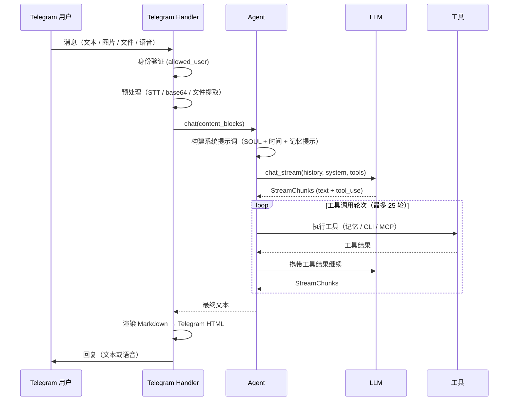

# Kernel 架构

面向贡献者和高级用户的技术文档。

<p align="center">
  简体中文 | <a href="ARCHITECTURE.md">English</a>
</p>

## 模块结构

```
kernel/
├── __init__.py
├── __main__.py                 # 入口点 (asyncio.run → run_bot)
├── bot.py                      # Telegram Application 初始化、Handler 注册
├── bot_logging.py              # 日志配置
├── bot_cleanup.py              # 定期临时文件清理
├── config.py                   # TOML 配置加载器（支持环境变量）
├── config_load.py              # 配置文件解析
├── config_types.py             # 数据类：Config、TelegramConfig、ProviderConfig 等
├── render.py                   # Markdown → Telegram HTML 渲染器（基于 mistune）
├── agent.py                    # Agent（通过 mixin 组合）
├── agent_chat.py               # 对话循环：流式输出、工具调度、历史记录
├── agent_tools.py              # 内置工具注册、CLI 委派、MCP 初始化
├── agent_sessions.py           # 会话创建/恢复/切换
├── agent_history.py            # 历史记录截断与精简
├── agent_titles.py             # 自动生成对话标题
├── agent_content.py            # 内容块序列化
├── tg_common.py                # BotState、用户校验、发送辅助函数
├── tg_message.py               # 主消息处理器（文本/图片/文件/语音）
├── tg_message_utils.py         # 文件类型检测、TTS 文本提取
├── tg_commands_sessions.py     # /new、/history、/resume、/retitle、/del_history
├── tg_commands_memory.py       # /remember、/memory、/forget
├── tg_commands_settings.py     # /provider、/model、/cancel、/status
├── models/
│   ├── base.py                 # 抽象基类：LLM、Message、ToolDef、StreamChunk、ContentBlock
│   ├── claude.py               # Anthropic Messages API 实现
│   └── openai_compat.py        # OpenAI 兼容 API 实现
├── memory/
│   ├── store.py                # SQLite 存储（会话、消息、设置、记忆）
│   ├── memories.py             # FTS5 全文搜索（jieba 分词），LIKE 回退
│   └── slim.py                 # 数据库存储内容精简
├── cli/
│   ├── base.py                 # CLIAgent 抽象基类、子进程生命周期、超时、输出截断
│   ├── claude_code.py          # Claude Code CLI 适配器
│   └── codex.py                # Codex CLI 适配器
├── mcp/
│   └── client.py               # MCP 客户端：stdio/HTTP 传输、工具注册、重连
├── tools/
│   └── registry.py             # 基于装饰器的工具注册表，从类型提示自动生成 schema
└── voice/
    ├── stt.py                  # 语音转文字（OpenAI Whisper API）
    └── tts.py                  # 文字转语音（Edge TTS → ffmpeg → Opus）
```

---

## 执行流程



---

## Agent 组合

`Agent` 类由五个 mixin 组合而成：

| Mixin | 职责 |
|-------|------|
| `AgentToolsMixin` | 内置工具、CLI 委派、MCP 工具注册 |
| `AgentSessionsMixin` | 会话生命周期（创建、恢复、切换） |
| `AgentHistoryMixin` | 上下文窗口管理、历史记录截断/精简 |
| `AgentChatMixin` | 流式对话循环、工具调度（最多 25 轮） |
| `AgentTitlesMixin` | 通过轻量级 LLM 自动生成会话标题 |

```python
class Agent(AgentToolsMixin, AgentSessionsMixin, AgentHistoryMixin, AgentChatMixin, AgentTitlesMixin):
    ...
```

---

## LLM 抽象层

**位置**：`models/base.py`

所有提供商实现 `LLM` 抽象类：

| 方法 | 用途 |
|------|------|
| `chat()` | 单次请求 → `LLMResponse` |
| `chat_stream()` | 流式请求 → `AsyncIterator[StreamChunk]` |
| `close()` | 资源清理 |

内容建模为类型化块：`TextContent`、`ImageContent`、`ToolUseContent`、`ToolResultContent`。

### 提供商

| 提供商 | 模块 | API |
|--------|------|-----|
| Anthropic Claude | `models/claude.py` | Anthropic Messages API（原生） |
| OpenAI 兼容 | `models/openai_compat.py` | OpenAI Chat Completions（支持 OpenAI、DeepSeek 等） |

提供商可在运行时通过 `/provider` 命令切换。

---

## 记忆系统

**位置**：`memory/store.py`、`memory/memories.py`

### 存储

SQLite 数据库（`data/kernel.db`），使用 WAL 模式。Schema 版本通过 `PRAGMA user_version` 追踪。

### 数据表

| 表 | 用途 |
|----|------|
| `sessions` | 对话元数据（标题、时间戳、归档标志） |
| `messages` | 聊天消息（JSON 内容，关联到会话） |
| `settings` | 键值存储（当前提供商、模型等） |
| `memories` | 长期记忆条目 |
| `memories_fts` | FTS5 虚拟表，用于全文搜索（如可用） |

### 全文搜索

**位置**：`memory/memories.py`

- 分词器：**jieba**（中英文分词）
- FTS5 索引在启动时构建；若 FTS5 不可用则回退到 `LIKE`
- 搜索策略：精确匹配 → OR 查询 → LIKE 回退
- 词项过滤（最小长度 2、去除停用词、最多 8 个词项）

### AI 驱动的记忆

系统提示词指示 LLM 在问题可能依赖用户偏好或历史时自主调用 `memory_search`。由 LLM 决定何时存储和检索——无硬编码触发器。

---

## 工具系统

**位置**：`tools/registry.py`

### 注册表

`ToolRegistry` 使用装饰器模式。参数 schema 从 Python 类型提示自动生成：

```python
@registry.tool("memory_add", description="Store to long-term memory")
async def memory_add(text: str) -> dict:
    ...
```

类型映射：`str→string`、`int→integer`、`float→number`、`bool→boolean`、`list[T]→array`、`Literal[...]→enum`。

### 内置工具

| 工具 | 用途 |
|------|------|
| `delegate_to_cli` | 将任务委派给 CLI 代理（Claude Code / Codex） |
| `memory_add` | 存储一条记忆 |
| `memory_search` | 搜索记忆 |
| `memory_list` | 列出所有记忆 |
| `memory_delete` | 按 ID 删除记忆 |

### MCP 工具

MCP 工具在启动时动态注册。工具名称规范化为 `mcp_{server}__{tool}` 格式（最长 64 字符，超长时使用 SHA1 后缀）。支持 stdio 和 HTTP（Streamable HTTP）两种传输方式。失败时自动重连（1 次重试）。

---

## CLI 委派

**位置**：`cli/base.py`、`cli/claude_code.py`、`cli/codex.py`

### 进程生命周期

1. 通过 `shutil.which` 解析命令
2. 创建子进程（`asyncio.create_subprocess_exec`，Windows 上使用 `_shell`）
3. 带超时等待（默认 600 秒）
4. 捕获 stdout/stderr，截断输出（最大 50K 字符）
5. 将原始输出保存到 `data/cli_outputs/`

### 工作目录

- 若提供了 `cwd`：直接使用
- 否则：在 `tasks/` 下创建唯一子目录（`s{session}_{cli}_{timestamp}_{uid}`）

### 取消

`/cancel` 命令 → `Agent.cancel()` → 对活跃 CLI 进程执行 `proc.kill()`。

---

## 语音管线

### 语音转文字

**位置**：`voice/stt.py`

OpenAI Whisper API（或兼容接口）。下载语音消息为 `.ogg`，转录后删除临时文件。

### 文字转语音

**位置**：`voice/tts.py`

1. Edge TTS 生成 MP3（免费，无需 API 密钥）
2. ffmpeg 将 MP3 转换为 Opus/OGG（48kbps）
3. 作为 Telegram 语音消息发送

ffmpeg 通过 `static-ffmpeg` 内置（无需系统安装）。

---

## Telegram 消息渲染

**位置**：`render.py`

自定义 **mistune** 渲染器（`TelegramHTMLRenderer`）将 Markdown 转换为 Telegram 兼容的 HTML：

| Markdown | Telegram HTML |
|----------|--------------|
| `**bold**` | `<b>bold</b>` |
| `*italic*` | `<i>italic</i>` |
| `` `code` `` | `<code>code</code>` |
| 代码块 | `<pre><code>...</code></pre>` |
| `~~strike~~` | `<s>strike</s>` |
| 列表 | `• item` |
| 引用块 | `▍ quoted` |

超过 4096 字符的消息会在段落/行边界处拆分，并正确修复 HTML 标签。

---

## 配置

**位置**：`config.py`、`config_types.py`、`config_load.py`

基于 TOML 的配置。API 密钥支持环境变量覆盖（`env: KERNEL_*`）。

### 配置段

| 段 | 必需 | 用途 |
|----|------|------|
| `[telegram]` | 是 | Bot token、允许的用户 ID |
| `[general]` | 是 | 时区、默认提供商、上下文轮数、记忆设置 |
| `[providers.*]` | 是（≥1） | LLM 提供商配置（类型、API 密钥、模型） |
| `[titles]` | 否 | 用于自动生成会话标题的轻量级 LLM |
| `[stt]` | 否 | 语音转文字（Whisper API 端点） |
| `[tts]` | 否 | 文字转语音（Edge TTS 语音名称） |
| `[cli.*]` | 否 | CLI 代理命令和参数 |
| `[[mcp.servers]]` | 否 | MCP 服务器连接 |

---

## 数据目录

所有运行时数据存放在 `data/` 下（可通过 `general.data_dir` 配置）：

```
data/
├── kernel.db           # SQLite 数据库（会话、消息、记忆、设置）
├── cli_outputs/        # CLI 代理原始输出文件
├── downloads/          # 临时文件下载（7 天后自动清理）
└── voice_replies/      # 临时 TTS 输出（7 天后自动清理）
```

定期清理每 6 小时运行一次，删除临时目录中超过 7 天的文件。

---

## 安全性

| 机制 | 详情 |
|------|------|
| 单用户认证 | 每条消息都会校验 `telegram.allowed_user` |
| 无入站端口 | 仅使用长轮询，不暴露 webhook |
| API 密钥隔离 | 密钥存于配置文件，支持环境变量覆盖 |
| 敏感信息脱敏 | 错误消息在发送到 Telegram 前会遮蔽 API 密钥 |
| CLI 沙箱 | CLI 代理作为子进程运行，支持可配置的标志 |

---

## 依赖

| 包 | 用途 |
|----|------|
| `python-telegram-bot` | Telegram Bot API |
| `anthropic` | Anthropic Claude API |
| `openai` | OpenAI 兼容 API |
| `aiosqlite` | 异步 SQLite |
| `jieba` | 中文分词（用于全文搜索） |
| `mistune` | Markdown 解析 |
| `mcp` | Model Context Protocol 客户端 |
| `httpx` | HTTP 客户端（用于 MCP） |
| `edge-tts` | 免费文字转语音 |
| `static-ffmpeg` | 内置 ffmpeg 二进制文件 |
| `tomli` | TOML 解析（Python < 3.12） |
| `tzdata` | 时区数据 |
